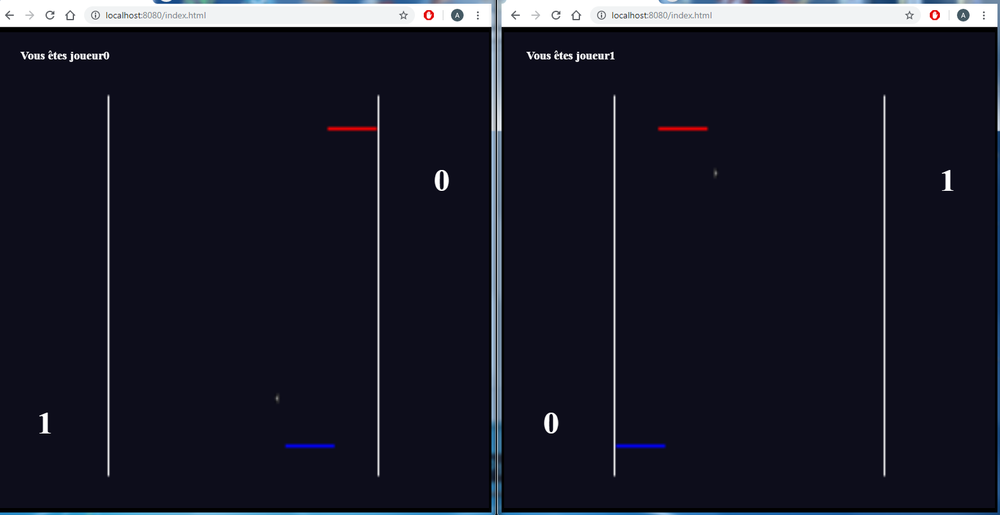

# NodePong

NodePong is a simple NodeJS application for playing to the Pong game in web browser

## Prerequisites

- [NodeJS](https://nodejs.org/en/)

## Usage

After downloading NodeJS, you can simply start the server when you are in the root path using in a terminal :

```
node server.js
```

Then go to your web browser and type :

```
http://localhost:8080/index.html
```

And now you can play !

